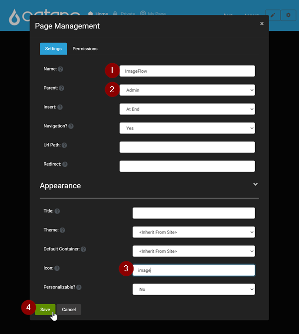
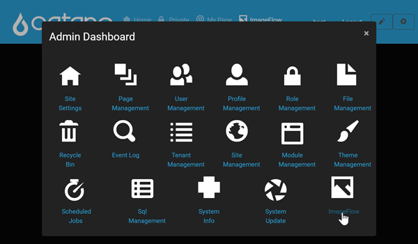
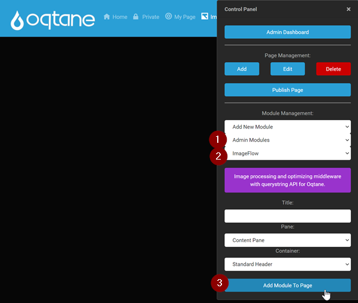
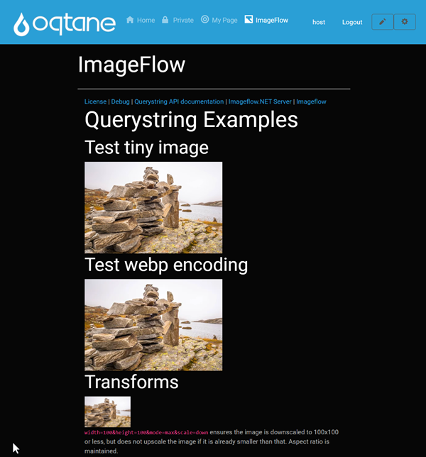

# ImageFlow Oqtane module

Image processing and optimizing middleware with querystring API for Oqtane 2.x.


## How to install Imageflow module in your Oqtane website?

1. Copy InstallPackages/ToSic.Oqt.ImageFlow.x.x.x.nupkg to your Oqtane.Server\wwwroot\Modules\.

1. Recycle your oqtane IIS AppPool if necessary.

1. Open your oqtane website in browser and login as host.

1. Add new page ImageFlow to Admin dashboard with 'image' icon.

    

1. Open page ImageFlow from Admin dashboard.

    

1. Add new admin module ImageFlow to ImageFlow page.

    

1. If you can see all images under Querystring Examples than Imageflow is installed OK.

    


## How create ToSic.Oqt.ImageFlow.x.x.x.nupkg?

1. Build release version and pack to ToSic.Oqt.ImageFlow.x.x.x.nupkg

    ```
    cd InstallPackages
    pack.cmd
    ```

## More info

1. [Querystring API documentation](https://docs.imageflow.io/querystring/introduction.html)
1. [Imageflow.NET Server](https://github.com/imazen/imageflow-dotnet-server)
1. [Imageflow](https://www.imageflow.io/)
