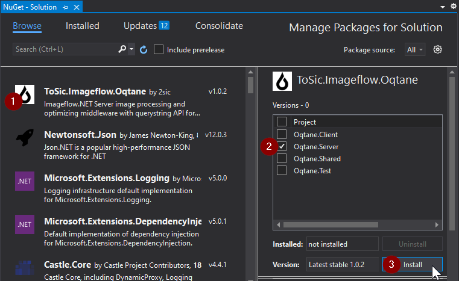

# Imageflow Oqtane module

[Imageflow.NET Server](https://github.com/imazen/imageflow-dotnet-server) image processing and optimizing middleware with querystring API for [Oqtane](https://www.oqtane.org/) 2.x.


# Install Imageflow module in Oqtane

Install it in standard way, as any other oqtane module.

## TODO - Option a)

1. Open **Module Management** in **Admin Dashboard**. On **Download** tab find **Imageflow** in list of modules. Click on its **Download** button. After download click on **Install**.

## Option b)

1. From https://github.com/2sic/oqtane-imageflow/releases download latest _ToSic.Imageflow.Oqtane.x.x.x-*.nupkg_.

2. Open **Module Management** in **Admin Dashboard** and select **Upload** tab. **Upload** _ToSic.Imageflow.Oqtane.x.x.x-*.nupkg_ and **Install**,

## Option c)

1. From https://github.com/2sic/oqtane-imageflow/releases download latest _ToSic.Imageflow.Oqtane.x.x.x-*.nupkg_.

1. Just copy _ToSic.Imageflow.Oqtane.x.x.x-*.nupkg_ package to your `Oqtane.Server\wwwroot\Modules\` and next oqtane website restart will auto-install Imageflow module as part of oqtane application startup process.


# TODO - Development in Oqtane.Framework with Imageflow nuget dependency

1. It is required to have [Oqtane.Framework](https://github.com/oqtane/oqtane.framework) development environment in folder **oqtane.framework**.
    ```
    git clone https://github.com/oqtane/oqtane.framework.git
    ```

1. In Visual Studio open `oqtane.framework\Oqtane.sln`.

1. Open **Manage nuget packages for solution..**, find _ToSic.Imageflow.Oqtane_ nuget package and **Install** to **Oqtane.Server** project as dependency.

    

1. Or, from https://github.com/2sic/oqtane-imageflow/releases download latest _ToSic.Imageflow.Oqtane.x.x.x-*.nupkg_ and just copy _ToSic.Imageflow.Oqtane.x.x.x-*.nupkg_ package to your `Oqtane.Server\wwwroot\Modules\`

# Develop Imageflow module in Oqtane.Framework

1. It is required to have [Oqtane.Framework](https://github.com/oqtane/oqtane.framework) development environment in folder **oqtane.framework**.
    ```
    git clone https://github.com/oqtane/oqtane.framework.git
    ```
1. By convention if you place the [Imageflow module](https://github.com/2sic/oqtane-imageflow) root folder at the same level as the **oqtane.framework**, then you will not have to modify any folder configuration in the `oqtane-imageflow\Src\Package\ToSic.Imageflow.Oqtane.Package.csproj` project.
    ```
    git clone https://github.com/2sic/oqtane-imageflow.git
    ```
## How to deploy Imageflow to Oqtane.Framework?

1. In Visual Studio open `oqtane-imageflow\Src\ToSic.Imageflow.Oqtane.sln`.

1. Build **Debug** or **Release** configuration and script will deploy Imageflow module to Oqtane.Framework.

1. In Visual Studio open `oqtane.framework\Oqtane.sln` and Run it.


## How to locally package ToSic.Imageflow.Oqtane.x.x.x-*.nupkg?

1. Build release version and pack to ToSic.Imageflow.Oqtane.x.x.x-*.nupkg
    ```
    cd InstallPackages
    pack.cmd
    ```


## More info

1. [Querystring API documentation](https://docs.imageflow.io/querystring/introduction.html)
1. [Imageflow.NET Server](https://github.com/imazen/imageflow-dotnet-server)
1. [Imageflow](https://www.imageflow.io/)
1. [Oqtane](https://github.com/oqtane/oqtane.framework)
